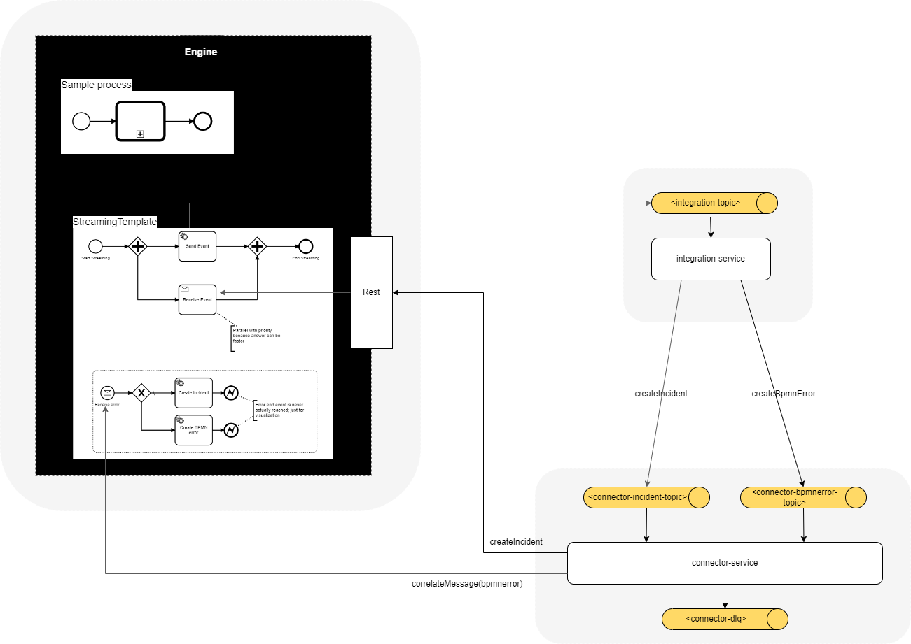

# Konzept zur Fehlerbehandlung

## Zielgruppe

* Integrationsentwickler
* Prozessmodelierer*innen

## Integrations

* Unterschied BPMN-Error u. Incident
  * wiederholbar 

* Integration: 
  * header:type = name of consumer-bean
  * payload:messageName -> bpmn message event  
  * Incident: cloudstream-utils:IncidentService (type incident)
  * configure createIncident-Function  
    ...
  * IncidentConsumer
  * IncidentServiceImpl: getEventSubscriptions("incident?")  
  * IncidentType("integrationError  
  * executionApi.createIncident  
  
  * Konfiguration: 
    * createIncident-Function
    * createIncident-destination = connector-Topic

Retries
By default, all messages are processed three times, at which point they are processed successfully, sent to a dead letter topic if configured, or just dropped.
spring.cloud.stream.bindings.<binding-name>.consumer.maxAttempts

transient errors: heilbar

enableExceptionsAfterUnhandledBpmnError

# kein retry bei nicht transienten exceptions
bindings:
planeEventProcessor-in-0:
destination: plane-events-v1
group: flight-api
consumer:
retryable-exceptions: io.henriquels25.cloudstream.demo.flightapi.plane.infra.stream.NoFlightFoundException: false

Deprecated:
[comment]: <> (    * message event "incident"  wird korreliert)

[comment]: <> (    * createIncidentDelegate  )

  * BpmnError: BpmnErrorService aus cloudstream-utils

